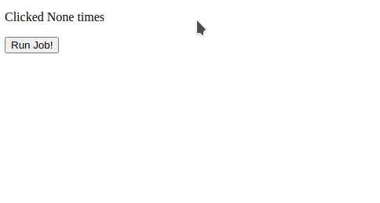
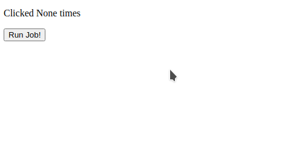
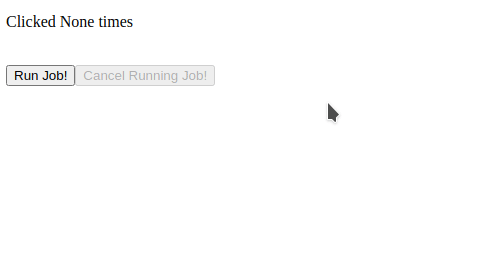
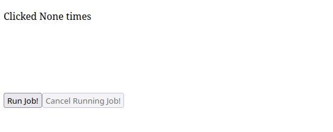

# 长时回调

大多数 Web 服务器默认有 30 秒的超时时间，这对于需要更长时间才能完成的回调是一个问题。虽然你可以在 Web 服务器上增加超时时间，但你可能会允许长时间运行的回调使用应用程序的所有工作人员，从而阻止其他请求通过。长回调为使用长时间运行的回调提供了一个可扩展的解决方案。

长回调可以通过装饰器 `@app.long_callback` 添加到你的应用程序中。带有此装饰器的回调使用由您配置的后端来运行回调逻辑。目前有两种选择：

- [DiskCache](http://www.grantjenks.com/docs/diskcache/index.html) 后端，在单独的进程中运行回调逻辑，并使用 `diskcache` 库将结果存储到磁盘。这是本地开发最容易使用的后端，但不推荐用于生产。
- 一个 [Celery](https://docs.celeryproject.org/en/stable/getting-started/introduction.html) 后端，在 Celery 工作器中运行回调逻辑，并通过 Celery 代理（如 [RabbitMQ](https://www.rabbitmq.com/) 或 [Redis](https://redis.io/)）将结果返回给 Dash 应用。与 Disk Cache 不同，它使用一个作业队列，并且不会意外地消耗所有服务器资源，因此建议在生产环境中使用此方法。

下面的示例使用 `diskcache` 管理器，它需要 `diskcache`、`multiprocess` 和 `psutil` 库：

```sh
$ pip install diskcache multiprocess psutil
```

使用长回调的第一步是使用选择的后端配置长回调管理器实例。

`@app.long_callback` 装饰器需要这个长回调管理器实例。您可以为 Dash 提供管理者实例。Dash 应用构造函数作为 `long_callback_manager` 关键字参数，或者作为 `manager` 参数 `@app.long_callback` 装饰本身。

在下面的五个示例中，我们将详细讨论如何实现长回调。

## 简单例子

下面是一个使用 `@app.long_callback` 的简单示例。注册一个更新 `html.P` 的回调函数表示按钮被单击的次数。回调使用 `time.sleep` 来模拟长时间运行的操作。

```python
import time
import dash
from dash import html
from dash.long_callback import DiskcacheLongCallbackManager
from dash.dependencies import Input, Output

## Diskcache
import diskcache
cache = diskcache.Cache("./cache")
long_callback_manager = DiskcacheLongCallbackManager(cache)

app = dash.Dash(__name__)

app.layout = html.Div(
    [
        html.Div([html.P(id="paragraph_id", children=["Button not clicked"])]),
        html.Button(id="button_id", children="Run Job!"),
    ]
)

@app.long_callback(
    output=Output("paragraph_id", "children"),
    inputs=Input("button_id", "n_clicks"),
    manager=long_callback_manager,
)
def callback(n_clicks):
    time.sleep(2.0)
    return [f"Clicked {n_clicks} times"]


if __name__ == "__main__":
    app.run_server(debug=True)
```



## 在回调运行时禁用按钮

注意，在前面的示例中，没有显示长回调正在运行。用户可能会在原始作业完成之前多次单击“Run Job!”按钮。我们可以通过在回调运行时禁用按钮，并在回调完成时重新启用它来解决这些缺点。

这是使用 `@app.long_callback` 的 `running` 参数完成的。这个参数接受一个由 3 个元素组成的元组列表。每个元组的第一个元素必须是一个 `Output` 依赖对象，该对象引用了应用布局中组件的属性。第二个元素是在回调运行时属性应该设置的值，第三个元素是回调完成时属性应该设置的值。

本例使用 `running` 来在回调运行时将按钮的 `disabled` 属性设置为 `True`，在回调完成时设置为 `False`。

在本例中，长回调管理器提供给 Dash。Dash 应用构造函数而不是 `@app.long_callback` 装饰。

```python
import time
import dash
from dash import html
from dash.long_callback import DiskcacheLongCallbackManager
from dash.dependencies import Input, Output

## Diskcache
import diskcache

cache = diskcache.Cache("./cache")
long_callback_manager = DiskcacheLongCallbackManager(cache)

app = dash.Dash(__name__, long_callback_manager=long_callback_manager)

app.layout = html.Div(
    [
        html.Div([html.P(id="paragraph_id", children=["Button not clicked"])]),
        html.Button(id="button_id", children="Run Job!"),
    ]
)

@app.long_callback(
    output=Output("paragraph_id", "children"),
    inputs=Input("button_id", "n_clicks"),
    running=[
        (Output("button_id", "disabled"), True, False),
    ],
)
def callback(n_clicks):
    time.sleep(2.0)
    return [f"Clicked {n_clicks} times"]


if __name__ == "__main__":
    app.run_server(debug=True)
```



### 可取消回调

这个示例建立在前一个示例的基础上，添加了对 `@app.long_callback` 使用 `cancel` 参数取消长时间运行的回调的支持。我们将 `cancel` 参数设置为一个 `Input` 依赖对象列表，这些对象引用应用布局中某个组件的属性。当此属性的值在回调运行时发生更改时，回调将被取消。注意，属性的值并不重要——值的任何更改都会取消正在运行的作业(如果有的话)。

```python
import time
import dash
from dash import html
from dash.long_callback import DiskcacheLongCallbackManager
from dash.dependencies import Input, Output

## Diskcache
import diskcache

cache = diskcache.Cache("./cache")
long_callback_manager = DiskcacheLongCallbackManager(cache)

app = dash.Dash(__name__, long_callback_manager=long_callback_manager)

app.layout = html.Div(
    [
        html.Div([html.P(id="paragraph_id", children=["Button not clicked"])]),
        html.Button(id="button_id", children="Run Job!"),
        html.Button(id="cancel_button_id", children="Cancel Running Job!"),
    ]
)

@app.long_callback(
    output=Output("paragraph_id", "children"),
    inputs=Input("button_id", "n_clicks"),
    running=[
        (Output("button_id", "disabled"), True, False),
        (Output("cancel_button_id", "disabled"), False, True),
    ],
    cancel=[Input("cancel_button_id", "n_clicks")],
)
def callback(n_clicks):
    time.sleep(2.0)
    return [f"Clicked {n_clicks} times"]


if __name__ == "__main__":
    app.run_server(debug=True)
```


## 进度条

这个例子使用了 `@app.long_callback` 的 `progress` 参数，在回调运行时更新进度条。我们将 `progress` 参数设置为 `Output` 依赖分组，该分组引用应用布局中组件的属性。

当一个依赖分组被分配给 `@app.long_callback` 的 `progress` 参数时，使用一个新的特殊参数作为函数的第一个参数。这个特殊的参数在下面的例子中被命名为 `set_progress`，它是一个函数句柄，修饰函数调用它是为了更新应用程序的当前进度。`set_progress` 函数接受单个参数，该参数对应于传递给 `@app.long_callback` 的 `progress` 参数的 `Output` 依赖项分组中指定的属性分组。

```python
import time
import dash
from dash import html
from dash.long_callback import DiskcacheLongCallbackManager
from dash.dependencies import Input, Output

## Diskcache
import diskcache
cache = diskcache.Cache("./cache")
long_callback_manager = DiskcacheLongCallbackManager(cache)

app = dash.Dash(__name__, long_callback_manager=long_callback_manager)

app.layout = html.Div(
    [
        html.Div(
            [
                html.P(id="paragraph_id", children=["Button not clicked"]),
                html.Progress(id="progress_bar"),
            ]
        ),
        html.Button(id="button_id", children="Run Job!"),
        html.Button(id="cancel_button_id", children="Cancel Running Job!"),
    ]
)

@app.long_callback(
    output=Output("paragraph_id", "children"),
    inputs=Input("button_id", "n_clicks"),
    running=[
        (Output("button_id", "disabled"), True, False),
        (Output("cancel_button_id", "disabled"), False, True),
        (
            Output("paragraph_id", "style"),
            {"visibility": "hidden"},
            {"visibility": "visible"},
        ),
        (
            Output("progress_bar", "style"),
            {"visibility": "visible"},
            {"visibility": "hidden"},
        ),
    ],
    cancel=[Input("cancel_button_id", "n_clicks")],
    progress=[Output("progress_bar", "value"), Output("progress_bar", "max")],
)
def callback(set_progress, n_clicks):
    total = 10
    for i in range(total):
        time.sleep(0.5)
        set_progress((str(i + 1), str(total)))
    return [f"Clicked {n_clicks} times"]


if __name__ == "__main__":
    app.run_server(debug=True,port=8054)
```



## 进度条形图

`@app.long_callback` 的 `progress` 参数可以用来更新任意组件属性。这个例子创建并更新了一个 Plotly 条形图来显示当前的计算状态。

这个例子还使用了 `long_callback` 的 `progress_default` 参数来指定一组值，当回调没有进行时，这些值应该被分配给由 `progress` 参数指定的组件。如果没有提供 `progress_default`，则在回调未运行时，`progress` 中指定的所有依赖项属性都将设置为 `None`。在本例中，`progress_default` 被设置为一个宽度为零的图形。

```python
import time
import dash
import dash_html_components as html
from dash import html, dcc
from dash.long_callback import DiskcacheLongCallbackManager
from dash.dependencies import Input, Output
import plotly.graph_objects as go

## Diskcache
import diskcache
cache = diskcache.Cache("./cache")
long_callback_manager = DiskcacheLongCallbackManager(cache)

def make_progress_graph(progress, total):
    progress_graph = (
        go.Figure(data=[go.Bar(x=[progress])])
        .update_xaxes(range=[0, total])
        .update_yaxes(
            showticklabels=False,
        )
        .update_layout(height=100, margin=dict(t=20, b=40))
    )
    return progress_graph


app = dash.Dash(__name__, long_callback_manager=long_callback_manager)

app.layout = html.Div(
    [
        html.Div(
            [
                html.P(id="paragraph_id", children=["Button not clicked"]),
                dcc.Graph(id="progress_bar_graph", figure=make_progress_graph(0, 10)),
            ]
        ),
        html.Button(id="button_id", children="Run Job!"),
        html.Button(id="cancel_button_id", children="Cancel Running Job!"),
    ]
)

@app.long_callback(
    output=Output("paragraph_id", "children"),
    inputs=Input("button_id", "n_clicks"),
    running=[
        (Output("button_id", "disabled"), True, False),
        (Output("cancel_button_id", "disabled"), False, True),
        (
            Output("paragraph_id", "style"),
            {"visibility": "hidden"},
            {"visibility": "visible"},
        ),
        (
            Output("progress_bar_graph", "style"),
            {"visibility": "visible"},
            {"visibility": "hidden"},
        ),
    ],
    cancel=[Input("cancel_button_id", "n_clicks")],
    progress=Output("progress_bar_graph", "figure"),
    progress_default=make_progress_graph(0, 10),
    interval=1000,
)
def callback(set_progress, n_clicks):
    total = 10
    for i in range(total):
        time.sleep(0.5)
        set_progress(make_progress_graph(i, 10))

    return [f"Clicked {n_clicks} times"]


if __name__ == "__main__":
    app.run_server(debug=True)
```



## Celery/Redis

我们建议在生产环境中使用 Celery/Redis 后端。

使用 Celery 和Redis，示例看起来像这样：

```python
import time
import dash
from dash import html
from dash.long_callback import CeleryLongCallbackManager
from dash.dependencies import Input, Output
from celery import Celery

celery_app = Celery(
    __name__, broker="redis://localhost:6379/0", backend="redis://localhost:6379/1"
)
long_callback_manager = CeleryLongCallbackManager(celery_app)

app = dash.Dash(__name__, long_callback_manager=long_callback_manager)

app.layout = html.Div(
    [
        html.Div([html.P(id="paragraph_id", children=["Button not clicked"])]),
        html.Button(id="button_id", children="Run Job!"),
        html.Button(id="cancel_button_id", children="Cancel Running Job!"),
    ]
)

@app.long_callback(
    output=Output("paragraph_id", "children"),
    inputs=Input("button_id", "n_clicks"),
    running=[
        (Output("button_id", "disabled"), True, False),
        (Output("cancel_button_id", "disabled"), False, True),
    ],
    cancel=[Input("cancel_button_id", "n_clicks")],
)
def callback(n_clicks):
    time.sleep(2.0)
    return [f"Clicked {n_clicks} times"]


if __name__ == "__main__":
    app.run_server(debug=True)
```

在 `DiskcacheLongCallbackManager` 的位置，我们使用 `CeleryLongCallbackManager` 并使用如下行导入Celery：`from celery import Celery`。

我们配置一个 Celery 应用程序（`celery_app`），并将其传递给 `CeleryLongCallbackManager`。它被存储在变量 `long_callback_manager` 中，然后传递给应用程序：

`app = dash.Dash(__name__, long_callback_manager=long_callback_manager)`

## 缓存结果

`@app.long_callback` 装饰器可以选择通过缓存来记忆回调函数的结果，并且它提供了一个灵活的 API 来配置缓存的结果何时可以被重用。